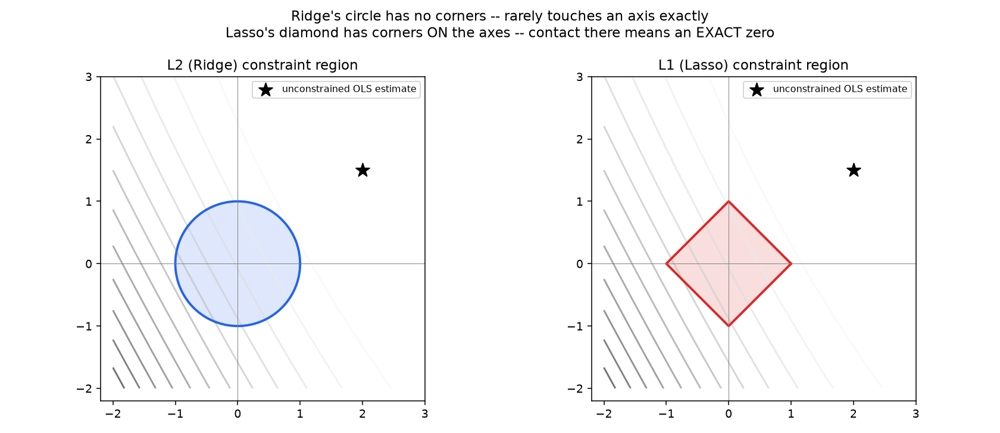
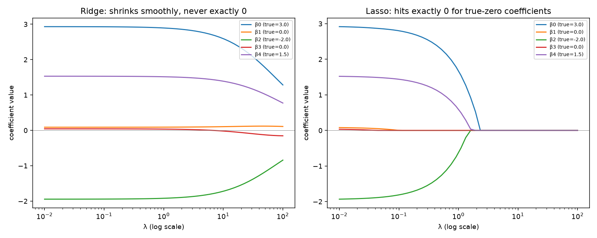

# 02 — Ridge, Lasso & Elastic Net

**Companion notebook:** [`02-ridge-lasso-elastic-net.ipynb`](./02-ridge-lasso-elastic-net.ipynb)
**Book references:** MML §9.2.2 (regularization, briefly); ESL §3.4 (Shrinkage Methods) is the canonical, thorough treatment.

Directly motivated by notebook 01's ending: OLS becomes numerically unstable under multicollinearity (condition number exploded ~1.9 million-fold from one near-duplicate feature).

---

## Ridge regression: fixing the singularity directly

Ridge adds an L2 penalty to the RSS objective: `minimize ‖y-Xβ‖² + λ‖β‖²`. Taking the gradient and setting to zero (identical derivation to notebook 01, with one extra term):

```
∇β [RSS(β) + λβᵀβ] = -2Xᵀ(y-Xβ) + 2λβ = 0
                        (XᵀX + λI)β = Xᵀy
                                  β = (XᵀX + λI)⁻¹ Xᵀy
```

Adding `λI` before inverting is exactly what fixes the singularity — a small positive value on every diagonal entry guarantees invertibility regardless of how close to singular `XᵀX` already was. Verified in the notebook against `sklearn.linear_model.Ridge` — exact match. Directly confirmed to fix notebook 01's instability: condition number dropped from **3,800,445** to **94.41** — a **40,255x** improvement in conditioning.

## Ridge is not a heuristic: it's exact MAP estimation

Statistics notebook 02 established MAP = MLE + a prior. Here's the concrete instance: assume a Gaussian likelihood for the noise and a **Gaussian prior** `β ~ N(0, τ²I)` on the coefficients. The negative log posterior is:

```
-log p(β|y) ∝ (1/2σ²)‖y-Xβ‖² + (1/2τ²)‖β‖² + const
```

Exactly the ridge objective, with `λ = σ²/τ²`. Ridge is not an ad-hoc fix for instability — it's the exact Bayesian MAP estimate under a Gaussian belief that coefficients are probably small. Verified numerically: optimizing the posterior directly with `scipy.optimize.minimize` and comparing against the closed-form ridge solution with `λ = σ²/τ²` gives **exactly the same estimator**.

## Lasso: L1 penalty, no closed form, coordinate descent

`minimize ‖y-Xβ‖² + λ‖β‖₁`. Because `|β|` is not differentiable at 0, there's no closed-form solution — the standard approach is **coordinate descent**: optimize one coefficient at a time, holding the others fixed, using the soft-thresholding operator that falls directly out of the L1 subgradient condition. Implemented from scratch and verified against `sklearn.linear_model.Lasso` — exact match once the objective's `1/(2n)` scaling convention matches sklearn's exactly.

## Why Lasso gives exact zeros and Ridge doesn't — the geometry

Reframe both penalties as hard constraints: `minimize RSS(β)` subject to `‖β‖₂ ≤ t` (Ridge) or `‖β‖₁ ≤ t` (Lasso). The solution sits where the RSS contours first touch the constraint region's boundary.



A **circle** (L2) has no corners — the tangent point can land anywhere on its boundary, essentially never exactly on an axis. A **diamond** (L1) has corners sitting exactly ON the axes, and because RSS contours are typically not perfectly aligned with the diamond's flat edges, the first point of contact is disproportionately likely to land at a corner — where one or more coefficients are exactly zero.



Confirmed directly across a range of `λ`: for the two coefficients whose true value is zero, Lasso reaches **exactly** `[0, -0]` at moderate `λ`; Ridge only shrinks toward `[0.091, 0.035]` — approaching but never touching zero.

## Elastic Net, and the bias-variance tradeoff

**Elastic Net** combines both penalties: `λ₁‖β‖₁ + λ₂‖β‖₂²`. Motivation: plain Lasso, applied to a group of highly correlated features, tends to arbitrarily pick ONE of them and zero out the rest — an unstable, somewhat arbitrary selection. Elastic Net's added L2 term tends to keep or drop correlated features together, trading a little of Lasso's sparsity for more stability.

**The bias-variance framing** (Statistics notebook 03, directly reused): every regularization strength `λ` above zero introduces bias (the estimate is pulled away from the unconstrained OLS optimum) in exchange for reduced variance (less sensitive to noise in the training data) — regularization is a deliberate, quantified move along the bias-variance tradeoff, not a free improvement, and choosing `λ` is exactly choosing a point on that curve.

---

## Self-check before moving on

- [ ] I can derive the Ridge closed-form solution and explain why adding `λI` fixes the singularity from notebook 01
- [ ] I can derive, and reproduce numerically, why Ridge is exact MAP estimation with a Gaussian prior
- [ ] I can implement Lasso via coordinate descent and explain the soft-thresholding operator's role
- [ ] I can explain, geometrically, why Lasso's diamond constraint produces exact zeros and Ridge's circle does not
- [ ] I can state when Elastic Net is preferred over plain Lasso (correlated feature groups)
- [ ] I can frame regularization strength as a deliberate bias-variance tradeoff, not a free win

Next: [`03-logistic-regression-softmax.md`](./03-logistic-regression-softmax.md)
