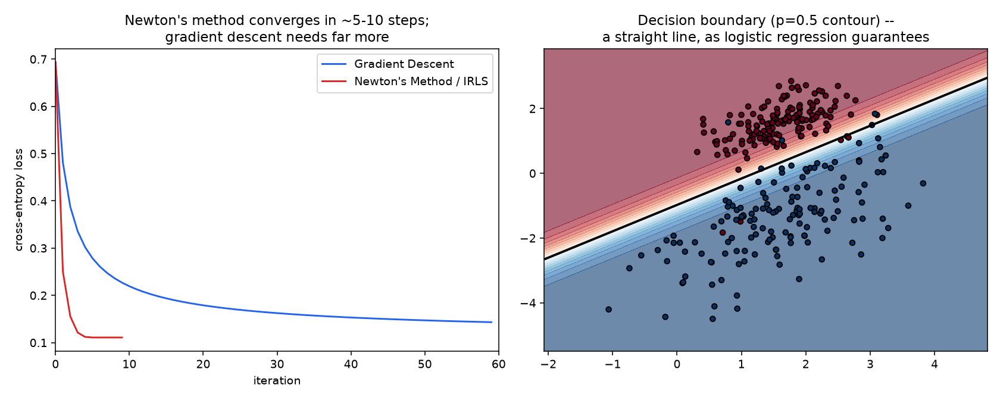

# 03 — Logistic Regression & Softmax

**Companion notebook:** [`03-logistic-regression-softmax.ipynb`](./03-logistic-regression-softmax.ipynb)
**Book references:** ESL §4.4 (Logistic Regression); Murphy Ch.10 (Logistic Regression) for the most thorough modern treatment; MML §12 touches classification via SVMs rather than logistic regression directly.

Unlike notebooks 01–02, this has **no closed-form solution** — motivating Newton's method (Advanced Optimization notebook 01) as a direct, dramatic upgrade over gradient descent. The multi-class softmax gradient derived here is *exactly* the one already derived in Calculus notebook 02 — verified to match, not re-derived from scratch.

---

## From linear regression to a probability

Thresholding linear regression's raw output for classification is a poor fit — unbounded output, no probabilistic interpretation. The fix: model the **log-odds** as linear in the features: `log(p/(1-p)) = wᵀx`. Solving for `p` gives the **sigmoid**: `p = 1/(1+e^(-wᵀx))`, guaranteeing `p ∈ (0,1)` for any input.

## The loss: cross-entropy, derived from MLE

Assume `y ~ Bernoulli(p)`, `p = sigmoid(wᵀx)`. The dataset's likelihood (Statistics notebook 02's MLE, applied) is `∏ pᵢ^yᵢ (1-pᵢ)^(1-yᵢ)`. The negative log gives the **binary cross-entropy loss** — the same cross-entropy from Information Theory notebook 01, now derived as the exact consequence of maximizing a Bernoulli likelihood, not a separately-invented loss function. No closed form exists — `p` is nonlinear in `w`. Verified in the notebook: gradient descent's converged solution matches `sklearn.linear_model.LogisticRegression` closely.

## Newton's method (IRLS): a direct, dramatic upgrade

Advanced Optimization notebook 01 showed Newton's method converges in one step on a pure quadratic. Logistic regression's loss isn't quadratic, but it's locally well-approximated by one, and Newton's method — called **Iteratively Reweighted Least Squares (IRLS)** in the statistics literature — converges dramatically faster than gradient descent here. The Hessian: `H = XᵀWX/n`, where `W` is diagonal with entries `p(1-p)` — exactly the "reweighting."

Measured directly: **Newton's method reaches loss 0.1109 in 10 steps**; **gradient descent is still at 0.2270 after the same 10 steps**, and needs 60 steps just to reach 0.1433 — still short of Newton's 10-step result. The decision boundary (right panel) is confirmed to be exactly linear, as the sigmoid's `p=0.5` contour (`wᵀx=0`) guarantees.

## Softmax: the multi-class generalization

For `k` classes: `p_c = exp(z_c) / Σⱼ exp(z_j)`. The gradient of softmax + cross-entropy — derived in full in **Calculus notebook 02** — is `∂L/∂logits = softmax(logits) - one_hot(y)`. Not re-derived here — used directly. The from-scratch implementation uses the exact log-sum-exp stability trick from **Advanced Optimization notebook 03** (`Z - Z.max(...)` before exponentiating), reused verbatim rather than reinvented.

Verified against `sklearn`'s multi-class logistic regression on a 3-class, 4-feature dataset: **identical training accuracy (95.3%) and 100% prediction agreement** between the from-scratch softmax implementation and `sklearn`.

---

## Self-check before moving on

- [ ] I can derive the sigmoid function from the log-odds/logit formulation
- [ ] I can derive binary cross-entropy loss from a Bernoulli MLE, connecting it to both Statistics notebook 02 and Information Theory notebook 01
- [ ] I can derive the logistic regression Hessian and explain why Newton's method converges so much faster here than gradient descent
- [ ] I can state the softmax + cross-entropy gradient from memory, and know it was already derived in Calculus notebook 02
- [ ] I can explain why the log-sum-exp trick is necessary here, tying back to Advanced Optimization notebook 03
- [ ] I can explain why logistic regression's decision boundary is always linear in the input features

This closes **Linear Models**. Next subchapter: **Tree-Based Methods**, starting with Decision Trees (CART).
