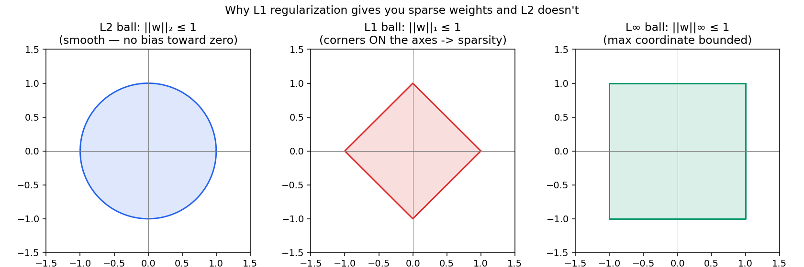
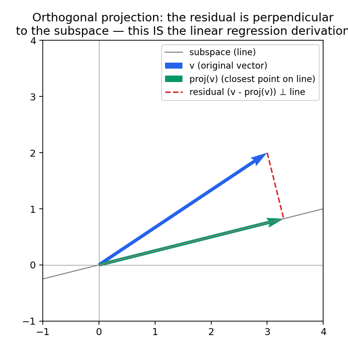

# 02 - Norms, Inner Products & Projections

**Companion code:** [`02-norms-inner-products-projections.py`](./02-norms-inner-products-projections.py)
**Book reference:** *Mathematics for Machine Learning* (Deisenroth, Faisal, Ong) (https://drive.google.com/file/d/1KsG9bntb0vD9QrUvHrlR2vqBQSr_V0J9/view) - §3.1–3.8, pp.71–90 (Norms, Inner Products, Lengths and Distances, Angles and Orthogonality, Orthonormal Basis, Orthogonal Complement, Inner Product of Functions, Orthogonal Projections)

---

## Norms: how "big" is a vector?

A norm is any function that measures a vector's length/size, satisfying a few sane rules (non-negative, scales linearly, triangle inequality). The three you need cold:

| Norm | Formula | Where it shows up in ML |
|---|---|---|
| L1 | `Σ|vᵢ|` | Lasso regularization, sparse solutions |
| L2 | `√(Σvᵢ²)` | Ridge regularization, Euclidean distance, weight decay |
| L∞ | `max|vᵢ|` | Adversarial perturbation bounds, gradient clipping |

```python
def l1_norm(v): return np.sum(np.abs(v))
def l2_norm(v): return np.sqrt(np.sum(v ** 2))
def linf_norm(v): return np.max(np.abs(v))
```

## Why L1 gives you sparsity and L2 doesn't - the picture that makes it click

This is one of the most-asked "explain the intuition" questions in ML interviews, and almost nobody explains it well without this picture:



Regularization adds a constraint region (the norm's "ball") that the optimal solution has to stay inside. The **L1 ball is a diamond with corners sitting exactly on the axes**. When the loss function's contours expand outward and touch this constraint region, they're disproportionately likely to touch at a corner - and a corner means some coordinates are *exactly* zero. The **L2 ball is a smooth circle with no corners**, so there's nothing pulling the solution toward exact zeros - coefficients shrink toward zero but rarely land exactly on it.

## Inner products and cosine similarity

The inner product (dot product in Euclidean space) `u · v = Σ uᵢvᵢ` measures both alignment and magnitude. Normalizing by both vectors' lengths gives you **cosine similarity**:

```python
def cosine_similarity(u, v):
    return (u @ v) / (l2_norm(u) * l2_norm(v))
```

This is the similarity metric behind nearly all embedding-based retrieval - semantic search, RAG document retrieval, recommendation systems. `cosine_similarity = 1` means same direction (maximally similar), `0` means orthogonal (unrelated), `-1` means opposite.

## Orthogonal projection - the derivation behind linear regression *and* PCA

Given a vector and a subspace, the **orthogonal projection** is the closest point in that subspace to the vector - "closest" in the sense that the leftover error (the residual) is perpendicular to the subspace.



Notice the residual (red dashed line) meets the subspace (gray line) at a right angle. That's not a coincidence - it's the defining property: **the residual is orthogonal to the subspace precisely when you've found the closest point.**

```python
def project_onto_subspace(v, basis):
    B = basis
    P = B.T @ np.linalg.inv(B @ B.T) @ B   # projection matrix
    return P @ v
```

**Why this is one of the highest-leverage ideas in the whole math track:**
- **Linear regression** - the normal equations `w = (XᵀX)⁻¹Xᵀy` are exactly this: `ŷ = Xw` is the orthogonal projection of `y` onto the column space of `X`. The residuals `y - ŷ` being orthogonal to `X`'s columns is the entire derivation.
- **PCA** - projecting data onto the top-k eigenvectors of the covariance matrix is choosing the k-dimensional subspace that minimizes total squared projection error (equivalent to maximizing retained variance).

If you can explain both of those bullets fluently, you've covered two of the most commonly-asked "derive this from scratch" ML interview questions with one geometric idea.

---

## Self-check before moving on

- [ ] I can explain why L1 regularization produces sparse solutions and L2 doesn't, using the unit-ball picture
- [ ] I can compute cosine similarity and explain what values close to 1, 0, and -1 mean
- [ ] I can state the defining property of an orthogonal projection (residual ⊥ subspace)
- [ ] I can explain how this projection idea underlies both linear regression and PCA

Next: [`03-eigenvalues-svd-pca.md`](./03-eigenvalues-svd-pca.md)
