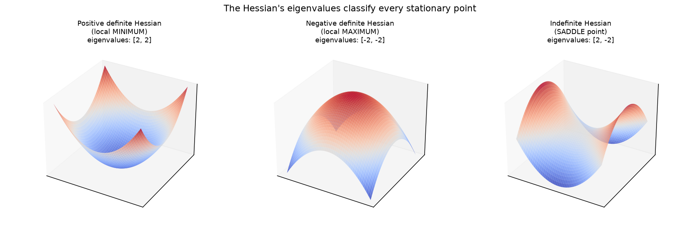
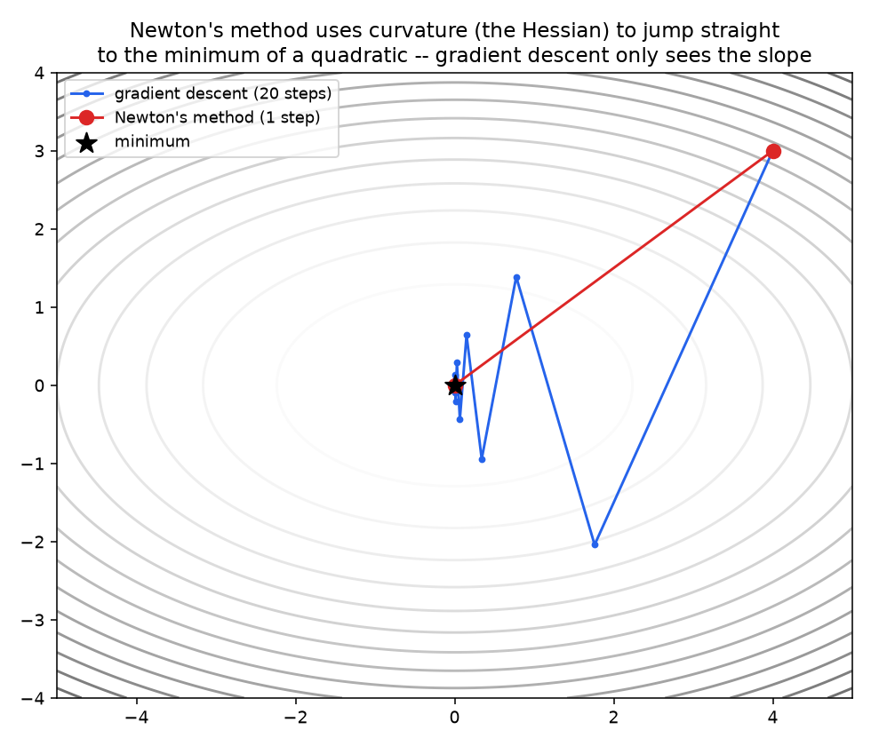

# 01 — Matrix Calculus & Second-Order Optimization

**Companion notebook:** [`01-matrix-calculus-hessian-newton.ipynb`](./01-matrix-calculus-hessian-newton.ipynb)
**Book reference:** *Mathematics for Machine Learning* (Deisenroth, Faisal, Ong) covers the basics used here — §5.4 Gradients of Matrices (pp.155–158) and §5.7 Higher-Order Derivatives (pp.164–165) — but has no dedicated identity reference sheet or Newton's method treatment. The identities below follow the standard reference (Petersen & Pedersen, *The Matrix Cookbook*, free online); Newton's method follows Nocedal & Wright, *Numerical Optimization*.

---

## Matrix calculus identities, verified numerically

Rather than a list of formulas to trust, every identity here is checked against a numerical (finite-difference) gradient — the same gradient-check technique from the Calculus subchapter.

- **Linear form:** `d(aᵀx)/dx = a`
- **Quadratic form:** `d(xᵀAx)/dx = (A + Aᵀ)x` (= `2Ax` if `A` is symmetric) — the one to actually memorize. It's the gradient behind every least-squares loss and every Gaussian log-likelihood, and it's the derivation behind the Hessian below.
- **Trace:** `d(tr(AᵀX))/dX = A`, and `d(tr(XᵀAX))/dX = (A+Aᵀ)X` — trace identities show up whenever a loss is written in matrix form (e.g. `tr(EᵀE)` for a residual matrix `E`); converting between trace form and plain gradient form is a common "derive this" interview step.

**Notation convention worth stating out loud in an interview:** for scalar loss `L` and vector `x`, `dL/dx` is defined to have the same shape as `x` (the "denominator layout" convention). For vector-valued `f: Rⁿ → Rᵐ`, the Jacobian `df/dx` is the `m×n` matrix from the Calculus subchapter. The Hessian, next, is just the Jacobian of the gradient — the gradient's own gradient.

## The Hessian

The Hessian `H` is the matrix of all second partial derivatives: `H[i,j] = ∂²f/∂xᵢ∂xⱼ`. For any twice-differentiable function it's symmetric (Clairaut's theorem). Its eigenvalues classify every stationary point:



- **All eigenvalues positive** (positive definite) → local minimum — curves up everywhere, the same eigenvalue intuition PCA (Linear Algebra subchapter) built, just applied to curvature instead of variance.
- **All eigenvalues negative** (negative definite) → local maximum.
- **Mixed signs** (indefinite) → saddle point — a minimum along some directions, a maximum along others. This is the practically dominant obstacle in deep learning loss surfaces, not bad local minima (a claim made in the Calculus subchapter's optimization notebook; the Hessian is what makes it precise).

**Connection to the second-order Taylor expansion:** `f(x+Δ) ≈ f(x) + ∇f(x)ᵀΔ + ½ΔᵀHΔ`. Gradient descent only uses the first (linear) term. Everything below comes from actually using the second (quadratic, Hessian) term.

## Newton's method

**Derivation:** minimize the quadratic approximation above with respect to `Δ` — take its gradient w.r.t. `Δ`, set to zero: `∇f(x) + HΔ = 0`, giving `Δ = -H⁻¹∇f(x)`:

```
x_new = x - H⁻¹ ∇f(x)
```

Instead of stepping a fixed distance along the gradient, Newton's method uses curvature to jump straight toward where the quadratic approximation's minimum actually is.



On this pure quadratic, Newton's method converges in **exactly one step** — the second-order Taylor expansion isn't an approximation here, it *is* the function, so jumping to its minimum is exact. For a non-quadratic function, Newton's method still converges dramatically faster near a minimum (quadratic convergence rate vs. gradient descent's linear rate), because locally, any smooth function looks approximately quadratic.

### Why Newton's method is not used to train neural networks

Two hard costs, both from needing the full Hessian: computing it is `O(n²)` entries for `n` parameters, and inverting it is `O(n³)`. For a model with even a few million parameters this is completely infeasible — precisely why deep learning relies on first-order methods (SGD, Adam — next notebook) or occasionally *quasi-Newton* methods (L-BFGS) that approximate the Hessian's effect from gradient history alone, without ever forming or inverting the full matrix.

There's also a correctness caveat, not just a cost one: plain Newton's method seeks any stationary point (`∇f=0`), including saddle points and maxima, not specifically minima — on a non-convex surface it can be attracted to a saddle just as readily as gradient descent slows near one.

---

## Self-check before moving on

- [ ] I can state and numerically verify the gradient of a quadratic form `xᵀAx`
- [ ] I can define the Hessian and explain why it's symmetric
- [ ] I can classify a stationary point as min/max/saddle from the Hessian's eigenvalue signs
- [ ] I can derive Newton's update rule from the second-order Taylor expansion
- [ ] I can explain why Newton's method is impractical for large neural networks, in terms of `O(n²)`/`O(n³)` cost
- [ ] I know Newton's method isn't guaranteed to move toward a minimum on non-convex surfaces

Next: [`02-adam-and-modern-optimizers.md`](./02-adam-and-modern-optimizers.md)
