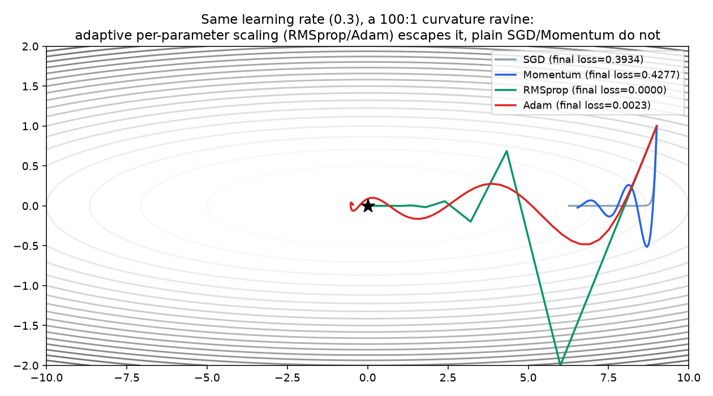

# 02 — Adam & Modern Optimizers, Derived

**Companion notebook:** [`02-adam-and-modern-optimizers.ipynb`](./02-adam-and-modern-optimizers.ipynb)
**References:** no book citation — follows the original papers (Adam: Kingma & Ba, 2015) rather than either uploaded book, neither of which names these methods. Extends the Calculus subchapter's optimization notebook, which mentioned Adam by name as "more cleverly" solving the learning-rate problem; this builds it up: momentum → RMSprop → Adam, one idea at a time, each verified on the same loss surface.

---

## The problem: a single learning rate cannot fit every direction

A "ravine" loss surface — steep in one direction, shallow in another — is the standard motivating example, and real loss surfaces are ravines almost everywhere: different parameters have very different curvatures, so any single global learning rate is too large for the steep directions or too small for the shallow ones. On a 100:1 curvature ratio ravine, plain SGD with `lr=0.3` barely moves in the shallow direction after 60 steps (final loss `0.393`).

## Momentum: smoothing the gradient over time

```
v_t = β·v_{t-1} + (1-β)·g_t
θ_t = θ_{t-1} - lr·v_t
```

Keep an exponential moving average of past gradients and step along *that* instead of the raw gradient. Oscillating gradients (the steep direction) partially cancel in the average; a gradient that consistently points the same way (the shallow direction) accumulates — physically, a ball rolling downhill that's built up speed. On the ravine above, momentum alone does **not** fix the problem (final loss `0.428`, no better than plain SGD) — both dimensions share the same velocity decay rate, so it doesn't correct for the curvature *mismatch* between them.

## RMSprop: a per-parameter learning rate

```
s_t = β·s_{t-1} + (1-β)·g_t²
θ_t = θ_{t-1} - lr·g_t / (√s_t + ε)
```

Momentum smooths direction but still applies one global learning rate. RMSprop tracks an exponential moving average of the *squared* gradient per parameter and divides the step by its square root — a parameter with a history of large gradients (steep direction) gets its effective step shrunk; a parameter with small gradients (shallow direction) gets it enlarged. This is exactly what a ravine needs: on the same surface, RMSprop converges almost perfectly (final loss `~0.000000`).

## Adam: momentum + RMSprop + bias correction

```
m_t = β₁·m_{t-1} + (1-β₁)·g_t                    (first moment: momentum)
v_t = β₂·v_{t-1} + (1-β₂)·g_t²                    (second moment: RMSprop)
m̂_t = m_t / (1 - β₁ᵗ)                              (bias-corrected)
v̂_t = v_t / (1 - β₂ᵗ)                              (bias-corrected)
θ_t = θ_{t-1} - lr · m̂_t / (√v̂_t + ε)
```

Default hyperparameters (from the original paper, still the near-universal default): `β₁=0.9`, `β₂=0.999`, `ε=1e-8`.

**Why bias correction matters, checked directly:** without it, `v₁ = (1-β₂)·g₁²` — with `β₂=0.999`, that's the raw estimate scaled by `0.001`, roughly 1000x too small on step 1, which would make the very first step size explode (`1/√v` blows up) before the estimate has had time to accumulate. The correction `v̂₁ = v₁/(1-β₂¹) = v₁/0.001` exactly cancels that. Verified numerically in the notebook: raw `v₁ = [3.24e-05, 4.00e-03]`, corrected `v̂₁ = [0.0324, 4.0]` — exactly `g₁²`, the honest one-sample estimate.



Momentum alone doesn't fix a curvature mismatch — it smooths direction, not per-parameter scale. RMSprop's per-parameter scaling alone solves this particular ravine almost perfectly. Adam's advantage over plain RMSprop shows up more on noisier, non-stationary losses (real minibatch training) than on this clean deterministic surface — which is exactly why it's the near-universal default in practice despite not looking dramatically better than RMSprop here.

## AdamW: the modern default

Plain Adam applies L2 weight decay by adding `λθ` to the gradient before the moment updates — which means weight decay gets divided by `√v̂` too, entangling it with the adaptive scaling in a way that wasn't intended. **AdamW** decouples this: weight decay is applied directly to the parameters, separately from the adaptive gradient step:

```
θ_t = θ_{t-1} - lr · m̂_t / (√v̂_t + ε) - lr · λ · θ_{t-1}      (decay applied directly, not through the gradient)
```

A small change with a real effect on generalization — why "AdamW," not plain "Adam," is the default optimizer in most modern training code, including the standard choice for fine-tuning transformers.

---

## Self-check before moving on

- [ ] I can write the momentum update rule and explain it as an exponential moving average of gradients
- [ ] I can write the RMSprop update rule and explain why it gives each parameter its own effective learning rate
- [ ] I can write Adam's four update equations from memory, including bias correction
- [ ] I can explain, with a number attached, why bias correction matters most in the first few steps
- [ ] I can explain what AdamW changes relative to Adam, and why it's the more common default today

Next: [`03-numerical-stability-bayesian-foundations.md`](./03-numerical-stability-bayesian-foundations.md)
