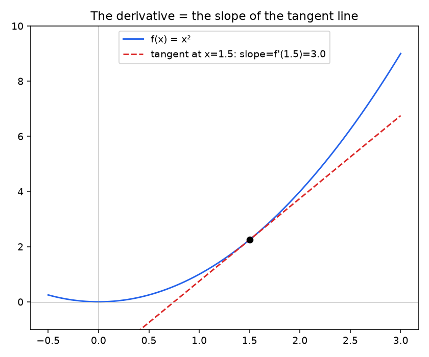
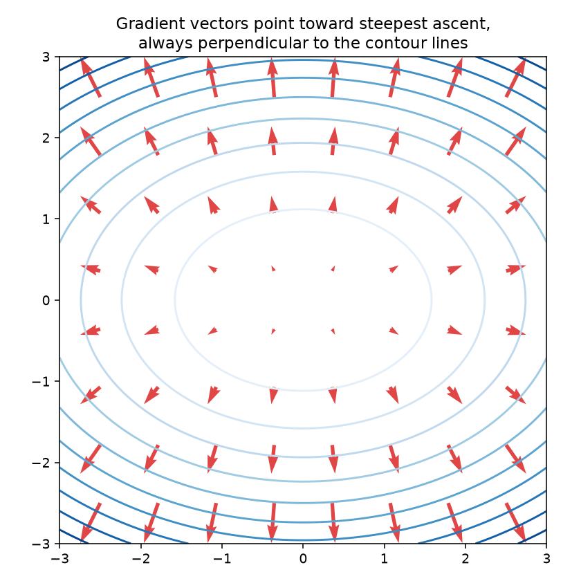

# 01 — Differentiation, Gradients & Jacobians

**Companion notebook:** [`01-differentiation-gradients-jacobians.ipynb`](./01-differentiation-gradients-jacobians.ipynb)
**Book reference:** *Mathematics for Machine Learning* (Deisenroth, Faisal, Ong) — §5.1–5.4, pp.141–157 (Differentiation of Univariate Functions, Partial Differentiation and Gradients, Gradients of Vector-Valued Functions, Gradients of Matrices)

---

## The derivative is just a slope

`f'(x)` is the slope of the tangent line to `f` at `x` — the limit of the slope of a secant line as the two points it connects get infinitely close:

```
f'(x) = lim_{h->0} [f(x+h) - f(x)] / h
```

Everything else in this chapter — gradients, Jacobians, backprop — is this same idea, generalized to more inputs and outputs.



## Partial derivatives and the gradient

For a function of several variables, `f(x, y)`, the **partial derivative** `∂f/∂x` treats `y` as fixed and differentiates with respect to `x` alone. Stack all the partial derivatives into a vector and you get the **gradient**:

```
∇f = [∂f/∂x1, ∂f/∂x2, ..., ∂f/∂xn]
```

The gradient has a crucial geometric property: **it always points in the direction of steepest ascent, and it's always perpendicular to the contour lines of `f`.** That single fact is the entire justification for gradient *descent* — step in the direction opposite the gradient to decrease the function fastest.



Every red arrow points "uphill," away from the center (the minimum), and every arrow crosses its local contour line at a right angle. Gradient descent just walks backward along these arrows.

## The gradient of MSE loss, worked by hand

For linear regression, `L(w) = (1/n)‖Xw - y‖²`. Using the chain rule (more on this in the next notebook):

```
∂L/∂w = (2/n) · Xᵀ(Xw - y)
```

The companion notebook verifies this analytic gradient against a **numerical gradient** (finite differences) — this "gradient check" technique is exactly what you'd do to sanity-check a backprop implementation, and it's a legitimate thing to mention in an interview if asked how you'd debug a suspicious gradient:

```python
def numerical_gradient(f, w, eps=1e-5):
    grad = np.zeros_like(w)
    for i in range(len(w)):
        w_plus, w_minus = w.copy(), w.copy()
        w_plus[i] += eps
        w_minus[i] -= eps
        grad[i] = (f(w_plus) - f(w_minus)) / (2 * eps)
    return grad
```

Running it: the analytic and numerical gradients agree to about `1e-11` — confirming the hand-derived formula is correct.

## Jacobians: the gradient's generalization to vector-valued functions

A **gradient** is defined for a scalar-valued function (one output). A **Jacobian** generalizes this to a *vector*-valued function `f: Rⁿ → Rᵐ` — it's the `m × n` matrix of all partial derivatives, one row per output, one column per input:

```
J[i, j] = ∂f_i / ∂x_j
```

A gradient is just a Jacobian with a single row (`m = 1`). This distinction matters because every layer of a neural network is a vector-valued function (many inputs, many outputs), so backpropagation is really chaining Jacobians together, not just chaining scalar derivatives — that's the subject of the next notebook.

---

## Self-check before moving on

- [ ] I can state the definition of a derivative as a limit, and explain it as "slope of the tangent line"
- [ ] I can explain why the gradient points in the direction of steepest ascent, and why it's perpendicular to contour lines
- [ ] I can derive the gradient of MSE loss w.r.t. the weights, from scratch
- [ ] I can explain the difference between a gradient and a Jacobian
- [ ] I know what a numerical gradient check is and why it's used

Next: [`02-chain-rule-backprop-autodiff.md`](./02-chain-rule-backprop-autodiff.md) ⭐
