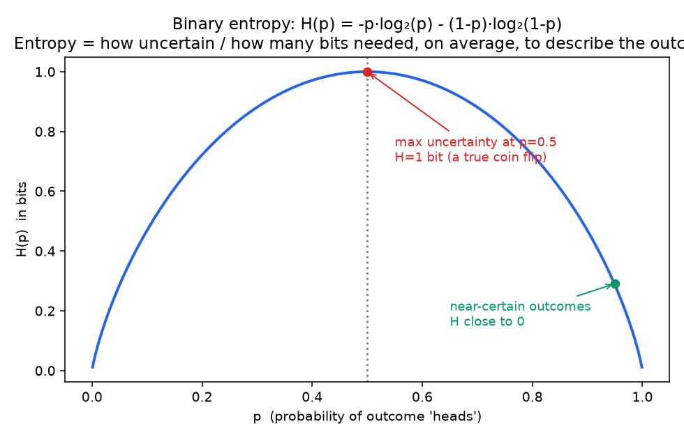
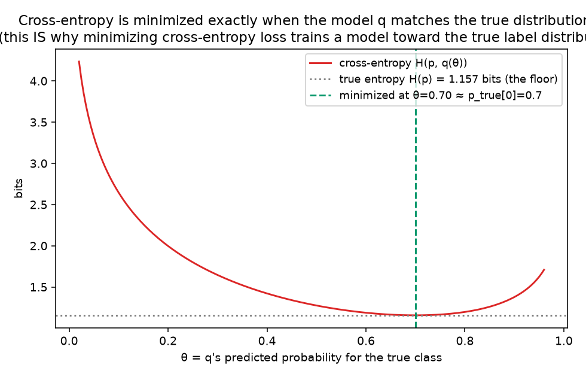

# 01 - Entropy & Cross-Entropy

**Companion notebook:** [`01-entropy-cross-entropy.ipynb`](./01-entropy-cross-entropy.ipynb)

**A note on references for this subchapter:** The core definitions here follow the standard treatment found in Cover & Thomas, *Elements of Information Theory*, or the freely available MacKay, *Information Theory, Inference, and Learning Algorithms* (2003) (https://drive.google.com/file/d/1_20b5q4IDgpDnUr_oKrKgWyFmi8sTeVJ/view) - which is in fact the exact book MML itself cites for mutual information.

---

## Entropy: how much uncertainty (or information) is in a distribution

Shannon entropy measures the average "surprise" of a distribution:

```
H(p) = -Σ p(x) log₂ p(x)
```

Measured in bits (using `log₂`) or nats (using natural log). Intuition: an outcome you were very confident about carries little information when it happens (unsurprising); a coin flip you had no idea about carries a lot of information once you see the result. Entropy is the *expected* amount of information/surprise, averaged over the distribution.



A fair coin (p=0.5) is maximally unpredictable - 1 full bit of uncertainty per flip. A heavily biased coin (p near 0 or 1) is nearly predictable - almost no uncertainty, almost no information gained by observing it. This exact curve is what a decision tree is trying to *reduce* at every split (notebook 3), and it's the reason a model that's very confident but wrong is penalized so much more harshly than one that's cautiously wrong - which brings us to cross-entropy.

## Cross-entropy: measuring one distribution with another's code

Entropy `H(p)` is the average number of bits needed to encode outcomes from `p`, using the *optimal* code for `p`. **Cross-entropy** asks: what if you encode outcomes from the true distribution `p`, but using a code built for a different (possibly wrong) distribution `q`?

```
H(p, q) = -Σ p(x) log₂ q(x)
```

Because the code isn't optimal for the actual data-generating distribution, `H(p, q) ≥ H(p)` always - using the wrong code can only cost you *more* bits on average, never fewer. That gap is exactly KL divergence (next notebook).



The cross-entropy curve bottoms out exactly where the model's predicted probability matches the true class frequency - the floor it approaches is the true entropy `H(p)` itself, which is the irreducible uncertainty even a perfect model can't beat (analogous to the irreducible noise term from the bias-variance decomposition in the Statistics chapter).

**This is precisely why cross-entropy is the standard classification loss**, and it isn't an arbitrary choice: minimizing `H(p, q)` over your model's parameters is *identical* to Maximum Likelihood Estimation. If `p` is the one-hot true label and `q` is your model's predicted distribution, `H(p, q) = -log q(true class)` - exactly the negative log-likelihood from the MLE notebook in the Statistics chapter. Cross-entropy loss, softmax + cross-entropy's gradient (from the Calculus chapter), and MLE (from the Statistics chapter) are three views of the exact same underlying idea.

---

## Self-check before moving on

- [ ] I can state the entropy formula and explain it as "expected surprise" or "average bits needed"
- [ ] I can explain why entropy is maximized for a uniform/fair distribution and minimized for a certain outcome
- [ ] I can state the cross-entropy formula and explain why `H(p,q) ≥ H(p)` always
- [ ] I can explain why minimizing cross-entropy loss is equivalent to Maximum Likelihood Estimation

Next: [`02-kl-divergence-mutual-information.md`](./02-kl-divergence-mutual-information.md) ⭐
