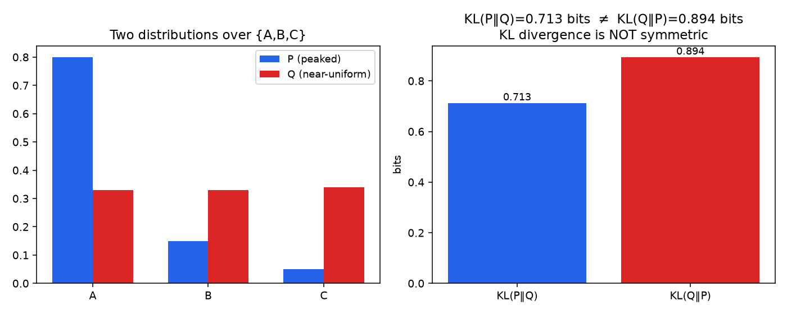
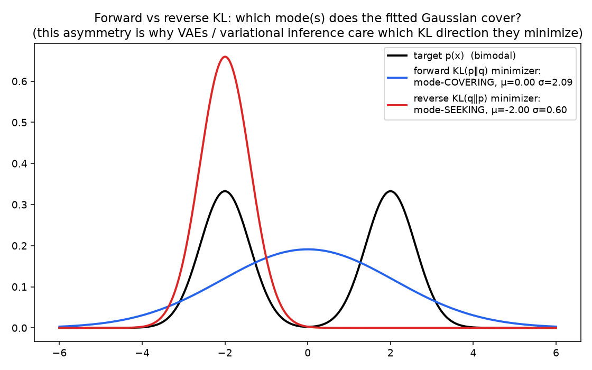
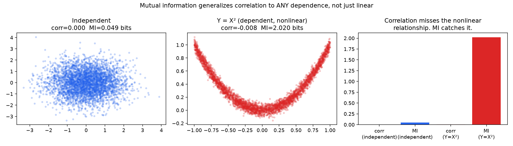

# 02 - KL Divergence & Mutual Information ⭐

**The single highest-interview-yield notebook in this subchapter for anyone touching modern generative models.** KL divergence underlies VAEs, diffusion models, RLHF/PPO, and knowledge distillation; mutual information underlies feature selection and representation-learning evaluation.

**Companion notebook:** [`02-kl-divergence-mutual-information.ipynb`](./02-kl-divergence-mutual-information.ipynb)
**References:** standard treatment (Cover & Thomas, *Elements of Information Theory*; MacKay, *Information Theory, Inference, and Learning Algorithms*) (https://drive.google.com/file/d/1_20b5q4IDgpDnUr_oKrKgWyFmi8sTeVJ/view) - see the note on references in [notebook 1](./01-entropy-cross-entropy.md).

---

## KL divergence: the gap left by cross-entropy

From the last notebook: `H(p,q) ≥ H(p)`, always. The gap between them is the **Kullback-Leibler (KL) divergence**:

```
KL(p‖q) = H(p, q) - H(p) = Σ p(x) log₂ [p(x) / q(x)]
```

It measures how much *extra* cost (in bits) you pay for using the wrong distribution `q` instead of the true `p`. Two properties worth having cold:
- **`KL(p‖q) ≥ 0` always, with equality iff `p = q`** (Gibbs' inequality) - this is exactly why gradient descent on cross-entropy loss can't do better than matching the true distribution.
- **`KL(p‖q) ≠ KL(q‖p)` in general - it's not a true distance/metric.**



## Forward vs. reverse KL: mode-covering vs. mode-seeking

The asymmetry isn't just a technicality - which direction you minimize changes *what kind of mistake* your approximation makes. Fit a single Gaussian `q` to a bimodal target `p`, once by minimizing `KL(p‖q)` (forward) and once by minimizing `KL(q‖p)` (reverse).



**Forward KL `KL(p‖q)`** (blue) is *mode-covering*: because `p(x) log[p(x)/q(x)]` blows up wherever `p` has mass but `q` doesn't, the optimizer is forced to spread `q` wide enough to cover everywhere `p` has probability - even if that means putting mass in the valley between the two modes, where the true density is actually low.

**Reverse KL `KL(q‖p)`** (red) is *mode-seeking*: the penalty only accumulates where `q` itself has mass, so it's free to collapse onto a single mode and simply ignore the rest of `p` entirely, as long as wherever it does place mass, `p` is high there too.

**Why this matters concretely:** variational inference (used in VAEs) minimizes `KL(q‖p)` - the reverse direction - which is part of why VAE posteriors tend to be mode-seeking / under-dispersed. Maximum likelihood training (used for most standard classifiers and generative models, including autoregressive language models) is equivalent to minimizing forward KL - mode-covering, which is part of why maximum-likelihood-trained generative models sometimes hedge across multiple plausible outputs rather than committing to one.

## Mutual information: correlation's more powerful cousin

**Mutual information** `I(X;Y)` measures how much knowing `X` reduces your uncertainty about `Y` - equivalently, `I(X;Y) = KL(P(X,Y) ‖ P(X)P(Y))`, the KL divergence between the actual joint distribution and what the joint would look like if `X` and `Y` were independent. `I(X;Y) = 0` exactly when `X` and `Y` are independent (unlike correlation, which can be zero even for strongly dependent variables - remember the `Y=X²` example from the Statistics chapter?).



The middle panel is the exact same `Y = X²` relationship that broke correlation back in the Statistics chapter - correlation is still ≈0 here, but mutual information registers roughly 2 bits of shared information, correctly flagging the (deterministic, if you squint past the added noise) dependence.

**Where this shows up in practice:** mutual-information-based feature selection catches predictive features that a correlation-based filter would silently discard; mutual information between an embedding and its inputs is used to diagnose representation collapse (an encoder that's ignoring parts of its input will show low MI with those parts); and the InfoNCE objective behind contrastive representation learning methods (SimCLR, CLIP) is, at its core, a mutual-information lower bound being maximized.

---

## Self-check before moving on

- [ ] I can define KL divergence in terms of cross-entropy minus entropy
- [ ] I can state why `KL(p‖q) ≥ 0` and why it's not symmetric
- [ ] I can explain mode-covering (forward KL) vs. mode-seeking (reverse KL) behavior, and name one model family that uses each
- [ ] I can define mutual information and explain why it catches nonlinear dependence that correlation misses
- [ ] I can name at least one practical ML use of mutual information beyond feature selection

Next: [`03-ml-applications-entropy.md`](./03-ml-applications-entropy.md)
