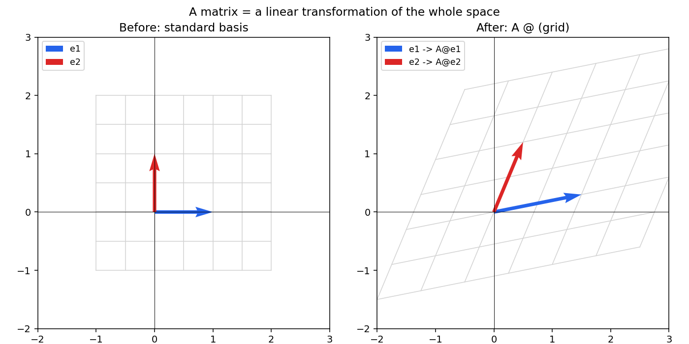
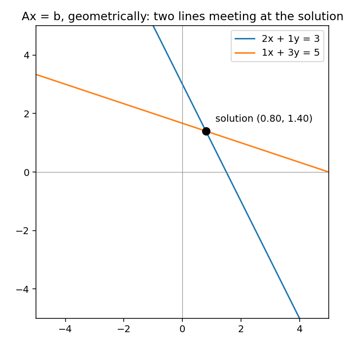

# 01 - Vectors, Spaces & Linear Transformations

**Companion code:** [`01-vectors-spaces-transformations.ipynb`](./01-vectors-spaces-transformations.ipynv)
**Book references:**
- *Mathematics for Machine Learning* (Deisenroth, Faisal, Ong) (https://drive.google.com/file/d/1KsG9bntb0vD9QrUvHrlR2vqBQSr_V0J9/view) 
- §2.1–2.3, pp.19–34 (Systems of Linear Equations, Matrices, Solving Systems of Linear Equations)
- §2.4–2.8, pp.35–63 (Vector Spaces, Linear Independence, Basis and Rank, Linear Mappings, Affine Spaces)

---
## Introduction
Linear algebra is the study of vectors and certain algebra rules to manipulate vectors. In general, vectors are special objects that can be added together and multiplied by scalars to produce another object of the same kind. From an abstract mathematical viewpoint, any object that satisfies these two properties can be considered a vector. Here are some examples of such vector objects:
- Geometric vectors
- Polynomials
- Audio signals
- Elements of Rn


## The one idea to actually internalize

**A matrix is not a grid of numbers - it's a function.** `Ax` means "take the vector `x` and transform it": rotate it, stretch it, shear it, project it into a different space. Every layer of a neural network does this (linear part first, nonlinearity second). Every embedding lookup, every attention projection - it's this operation, over and over, at scale. If you only remember one thing from linear algebra for ML interviews, remember this.



The left panel is the input space - the grid and the two basis vectors `e1 = (1,0)`, `e2 = (0,1)`. The right panel is what happens after applying:

```
A = [[1.5, 0.5],
     [0.3, 1.2]]
```

Notice the grid lines are still straight and evenly spaced (that's what makes it *linear* - it preserves lines and the origin) but the whole space has been sheared and stretched. `A`'s columns are literally where `e1` and `e2` land - that's the fastest way to read off what a matrix "does" just by looking at it.

## Systems of linear equations = intersecting lines

`Ax = b` for a 2×2 system is exactly two lines on a plane; the solution is where they cross.



This is worth holding onto because it generalizes cleanly:
- **Unique solution** → lines/planes intersect at exactly one point → `A` is invertible (`det(A) ≠ 0`).
- **No solution** → lines are parallel, never meet → equations are inconsistent.
- **Infinite solutions** → lines are the same line → equations are redundant (rank-deficient).

In ML terms: this is exactly why `XᵀX` needs to be invertible for the closed-form linear regression solution `w = (XᵀX)⁻¹Xᵀy` to exist - if your features are collinear (redundant), `XᵀX` becomes singular, same failure mode as the "infinite solutions" case above.

## Vector spaces, span, and linear independence

- A **vector space** is a set of vectors closed under addition and scalar multiplication - informally, "everywhere you can get to by combining these vectors."
- The **span** of a set of vectors is every point reachable via their linear combinations.
- Vectors are **linearly independent** if none of them is a combination of the others - equivalently, the only way to combine them to get the zero vector is with all-zero coefficients.

```python
# from the companion .py file
def is_linearly_independent(vectors: np.ndarray) -> bool:
    return bool(np.linalg.matrix_rank(vectors) == vectors.shape[0])
```

## Basis and rank

- A **basis** is a minimal set of vectors that spans the whole space - every vector in the space has a unique representation as a combination of basis vectors.
- The **rank** of a matrix is the dimension of its column space - how much of the output space it can actually reach. A matrix with rank less than its number of columns is "losing information": multiple different inputs can map to the same output.

```
full rank (independent rows):        shape=(3, 3), rank=3, independent=True
rank-deficient (row3 = row1 + row2): shape=(3, 3), rank=2, independent=False
duplicate rows:                      shape=(2, 2), rank=1, independent=False
```

**Why this matters in interviews:** "full rank" comes up constantly - feature collinearity breaking `XᵀX` invertibility, why you drop one dummy variable in one-hot encoding (to avoid a redundant, linearly dependent column), why weight matrices in a low-rank adapter (LoRA) are deliberately constrained to low rank to reduce trainable parameters.

## Linear mappings

Every linear map between finite-dimensional vector spaces can be represented as a matrix, once you fix a basis. This is *why* neural network layers are matrices: a fully-connected layer literally is the matrix representation of a linear map from the input space to the output space (before the nonlinearity is applied).

---

## Self-check before moving on

- [ ] I can explain, without notes, what `Ax` does geometrically
- [ ] I can read off roughly what a 2×2 matrix does to the plane just by looking at its columns
- [ ] I can explain why `XᵀX` needs to be full rank for linear regression's closed-form solution to exist
- [ ] I can state the definition of linear independence in one sentence

Next: [`02-norms-inner-products-projections.md`](./02-norms-inner-products-projections.md)
