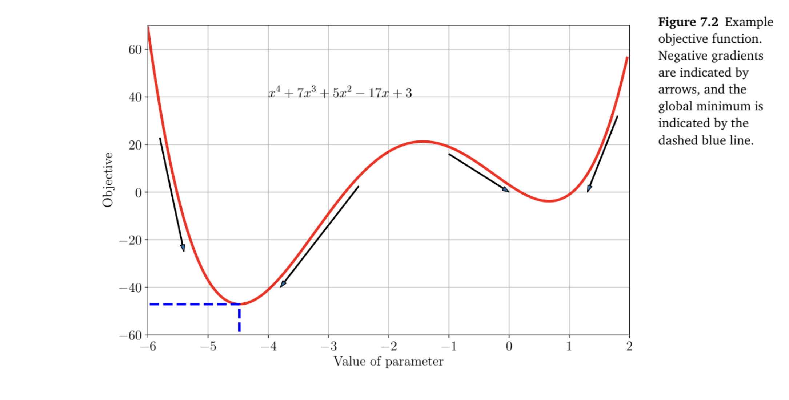
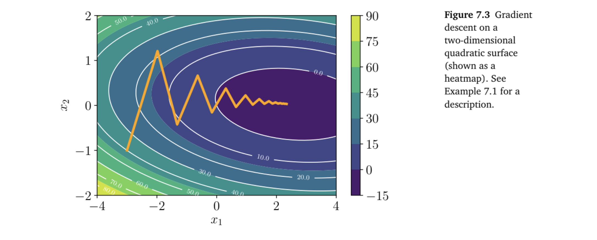
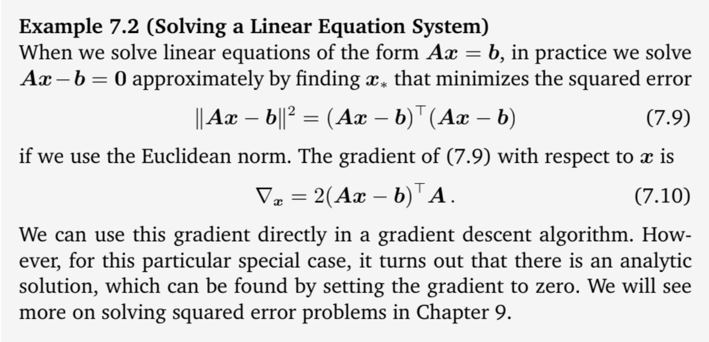
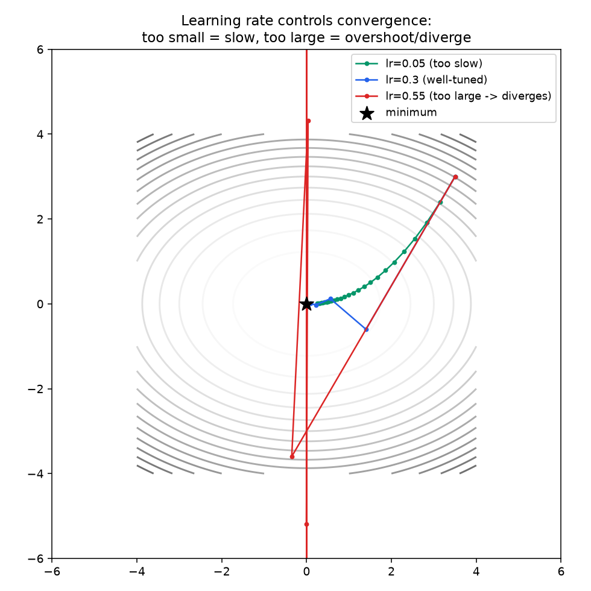
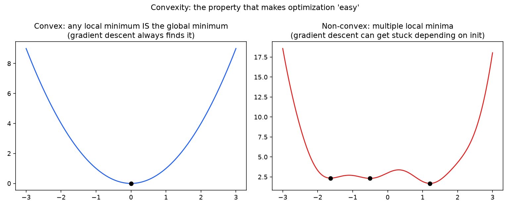
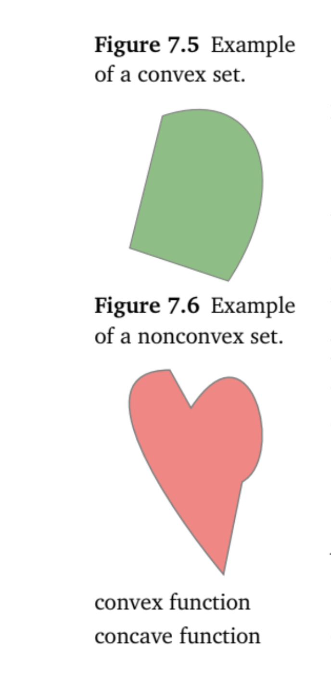
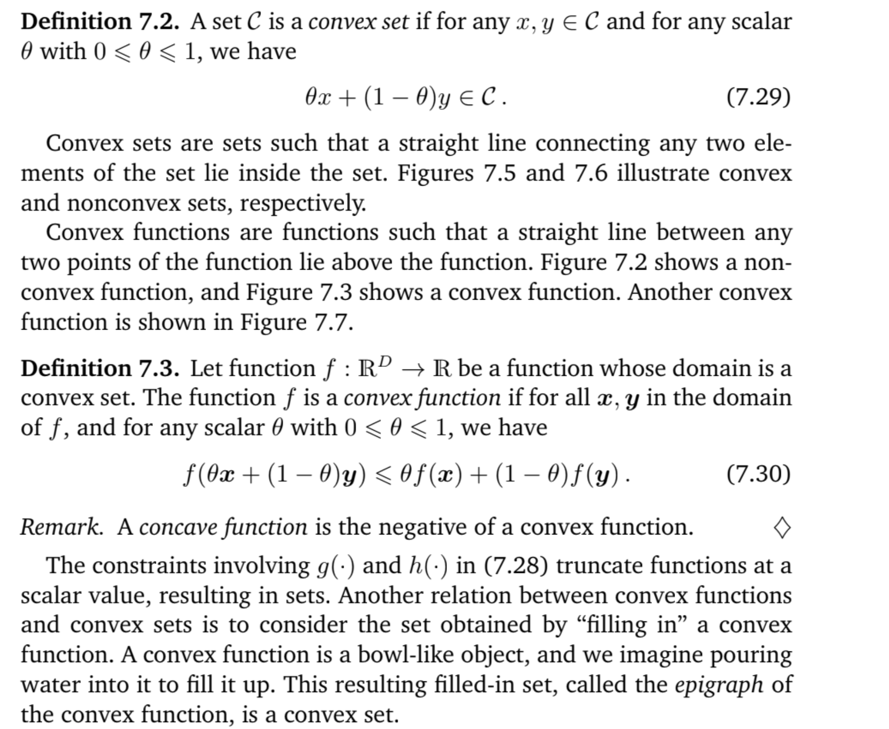
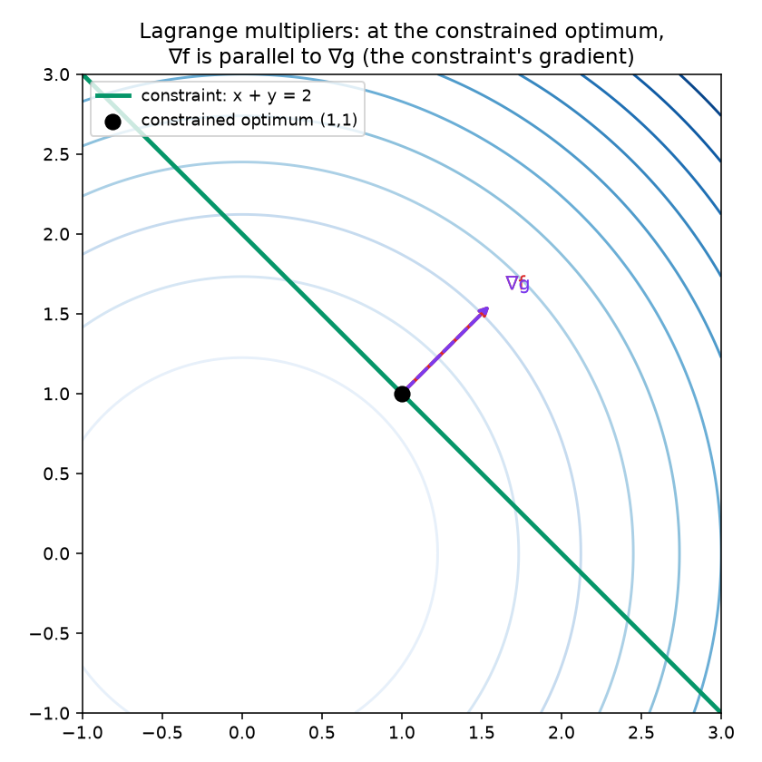

# 03 - Optimization: Gradient Descent, Convexity & Constrained Optimization

**Companion notebook:** [`03-optimization-gradient-descent-convexity.ipynb`](./03-optimization-gradient-descent-convexity.ipynb)

**Book reference:** 
*Mathematics for Machine Learning* (Deisenroth, Faisal, Ong) [https://drive.google.com/file/d/1KsG9bntb0vD9QrUvHrlR2vqBQSr_V0J9/view]

- §7.1–7.3, pp.227–246 (Optimization Using Gradient Descent, Constrained Optimization and Lagrange Multipliers, Convex Optimization)

## Optimization algorithms

Training a machine learning model often boils down to finding a good set of parameters. The notion of “good” is determined by the objective function or the probabilistic model.

Given an objective function, finding the best value is done using optimization algorithms.

There are two main branches of continuous optimization, unconstrained and constrained optimization.

We will assume that our objective function is differentiable hence we have access to a gradient at each location in the space to help us find the optimum value. By convention, most objective functions in machine learning are intended to be minimized, that is, the best value is the minimum value.




## Optimization using Gradient descent

Intuitively finding the best value is like finding the val-
leys of the objective function, and the gradients point us uphill. The idea is to move downhill (opposite to the gradient) and hope to find the deepest
point. For unconstrained optimization, this is the only concept we need,
but there are several design choices.




From the first notebook: the gradient points toward steepest ascent. Gradient descent just walks the opposite way:

```
x_{t+1} = x_t - lr * ∇f(x_t)
```

The learning rate `lr` controls step size, and it's the single most consequential hyperparameter in this whole update rule. Let's see why, on a simple convex bowl `f(x, y) = x² + 2y²`.



Green (`lr=0.05`) crawls toward the minimum - stable but wastes steps. Blue (`lr=0.3`) converges cleanly in just a few steps. Red (`lr=0.55`) overshoots on every step and diverges outright along the steeper `y` direction.

This isn't just a toy example - the exact instability you see for the red trajectory (`lr` too large relative to the curvature of the loss surface) is why training loss occasionally spikes to `NaN` with too-aggressive learning rates, and it's the mechanical reason learning rate warmup and schedules exist: start small while the loss surface is poorly understood, increase once training stabilizes, then decay as you approach the minimum and want to stop overshooting it.

**Momentum and Adam, briefly:** plain SGD uses only the current gradient. Momentum adds a running average of past gradients (dampens oscillation in high-curvature directions, like the red trajectory above). Adam additionally adapts the effective learning rate per-parameter based on the recent magnitude of that parameter's gradients - both are, at their core, still trying to solve exactly the instability shown above, just more cleverly than a fixed global learning rate. 

For more, read page 237.

## Convexity: the property that makes "gradient descent finds the optimum" a guarantee

A function is **convex** if the line segment between any two points on its graph lies above (or on) the graph - equivalently, its curvature never bends the "wrong way." The huge practical consequence: **for a convex function, any local minimum is automatically the global minimum.**



We focus our attention of a particularly useful class of optimization problems, where we can guarantee global optimality. When f(·) is a convex function, and when the constraints involving g(·) and h(·) are convex sets, this is called a convex optimization problem. In this setting, we have strong duality: The optimal solution of the dual problem is the same as the optimal solution of the primal problem. The distinction between convex functions and convex sets are often not strictly presented in machine learning literature, but one can often infer the implied meaning from context.





Linear regression and logistic regression have convex loss surfaces - that's why their "solve to convergence" behavior is so reliable. **Neural network loss surfaces are almost never convex.** In high dimensions, though, the practically dominant obstacle isn't usually "bad" local minima (most local minima in an overparameterized network turn out to be nearly as good as the global one) - it's **saddle points**, where the gradient is zero but the point is a minimum along some directions and a maximum along others. This is one of the more nuanced, senior-level interview points: "why doesn't non-convexity doom deep learning in practice?"

## Constrained optimization and Lagrange multipliers

Sometimes you don't want to minimize `f(x)` freely - you want to minimize it *subject to* a constraint, `g(x) = 0`. The classic method: introduce a **Lagrange multiplier** `λ` and optimize the Lagrangian `L(x, λ) = f(x) - λg(x)`.

The key geometric insight: **at the constrained optimum, the gradient of `f` is parallel to the gradient of the constraint `g`.** If they weren't parallel, you could slide along the constraint surface and keep decreasing `f` further - so parallel gradients is precisely the "can't improve any further while staying on the constraint" condition.



The black dot is the closest point on the constraint line to the origin (the unconstrained minimum of `x²+y²`). At that point, `∇f` (red) and `∇g` (purple, the constraint's gradient - always perpendicular to the constraint line) point in exactly the same direction. That parallelism condition, `∇f = λ∇g`, is the Lagrange multiplier equation.

**Why this matters for ML interviews specifically:** the derivation of the **SVM dual problem** goes through exactly this machinery (constrained optimization with inequality constraints, generalized via KKT conditions - the inequality-constraint extension of Lagrange multipliers). If you've ever wondered where the "support vectors" and the dual formulation in SVMs actually come from mathematically, this is it.
