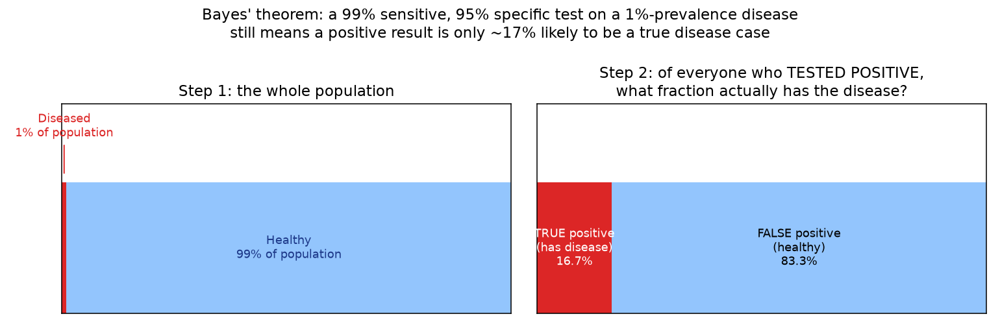
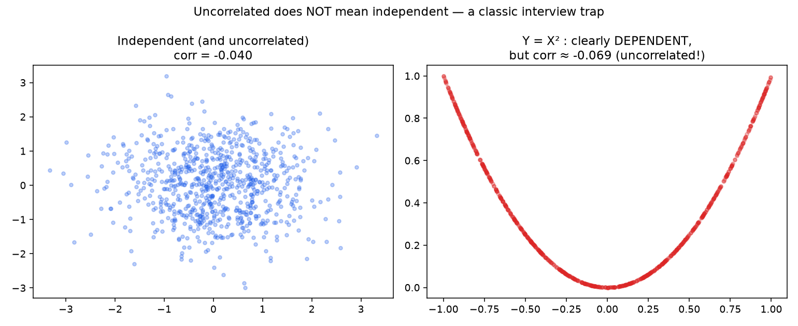

# 01 - Probability Foundations & Bayes' Theorem

**Companion notebook:** [`01-probability-foundations-bayes.ipynb`](./01-probability-foundations-bayes.ipynb)

**Book reference:** *Mathematics for Machine Learning* (Deisenroth, Faisal, Ong) [https://drive.google.com/file/d/1LGisFRLBa8YojQ7EOd4rPUWeicjsN8ys/view]
- §6.1–6.4, pp.172–186 (Construction of a Probability Space, Discrete and Continuous Probabilities, Sum Rule/Product Rule/Bayes' Theorem, Summary Statistics and Independence)


## The building blocks: joint, marginal, conditional

- **Joint probability** `P(A, B)` - the probability both `A` and `B` happen.
- **Marginal probability** `P(A)` - the probability of `A` alone, found by summing (or integrating) the joint over all values of `B`.
- **Conditional probability** `P(A|B)` - the probability of `A` *given that* `B` has happened: `P(A|B) = P(A,B) / P(B)`.

Two rules connect these:
- **Sum rule:** `P(A) = Σ_B P(A, B)` (marginalize out `B`)
- **Product rule:** `P(A, B) = P(A|B)·P(B) = P(B|A)·P(A)`

## Bayes' theorem - derived, not memorized

The product rule gives two ways to write the same joint probability: `P(A|B)P(B) = P(B|A)P(A)`. Divide both sides by `P(B)`:

```
P(A|B) = P(B|A) · P(A) / P(B)
```

That's Bayes' theorem. In the form you'll actually use it, with `H` for hypothesis and `E` for evidence:

```
P(H|E) = P(E|H) · P(H) / P(E)
       = likelihood × prior / evidence
       = posterior
```

## The classic worked example - and why it trips people up

A disease affects 1% of a population. A test is 99% sensitive (`P(+|disease)=0.99`) and 95% specific (`P(-|healthy)=0.95`). If someone tests positive, what's `P(disease | positive)`? Intuition says "almost certainly" - the real answer is much lower.



The math: `P(D|+) = P(+|D)P(D) / P(+) = 0.99×0.01 / (0.99×0.01 + 0.05×0.99) ≈ 16.7%`.

Even with a highly accurate test, most positives are false positives - because the disease is rare (low prior), the small false-positive rate applied to the *much larger* healthy population still outnumbers the true positives from the *much smaller* diseased population. This "base rate" reasoning generalizes directly to ML: it's the same reason a classifier can have 99% accuracy and still be nearly useless on a highly imbalanced dataset (predicting "no fraud" always gets you 99%+ accuracy if fraud is rare) - precision, not accuracy, is what tells you whether a positive prediction is trustworthy, and precision has exactly this Bayes'-theorem structure (`TP / (TP + FP)`).

## Independence vs. zero correlation - a classic trap

Two variables are **independent** if knowing one tells you nothing about the other: `P(A,B) = P(A)P(B)`. They're **uncorrelated** if their (linear) correlation coefficient is zero. Independence implies zero correlation - but the reverse is *not* true, and interviewers love this gap.



The right panel is completely deterministic - knowing `X` tells you `Y` *exactly* - yet the linear correlation is essentially zero, because correlation only measures *linear* association, and this relationship is symmetric/quadratic. This is exactly why feature engineering sometimes adds explicit non-linear transforms (`x²`, interaction terms) even when a raw feature shows no linear correlation with the target - the relationship can still be there, just not linear.

---

## Self-check before moving on

- [ ] I can derive Bayes' theorem from the product rule, not just recite it
- [ ] I can work the disease-testing example from scratch and explain intuitively why the answer is low
- [ ] I can connect this base-rate reasoning to precision on imbalanced classification datasets
- [ ] I can state the difference between independence and zero correlation, with an example

Next: [`02-distributions-mle-map.md`](./02-distributions-mle-map.md) ⭐
