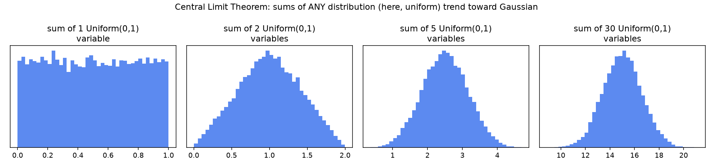
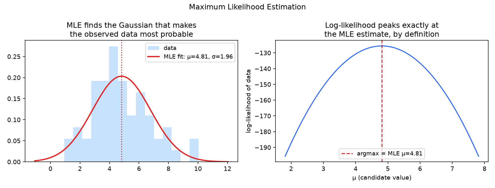
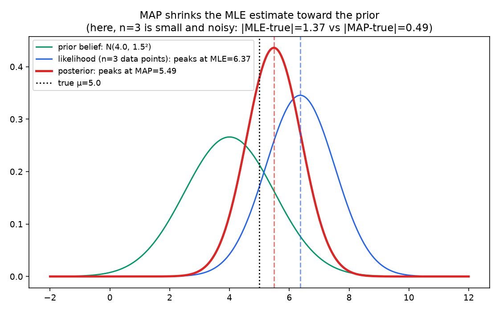

# 02 - Distributions, MLE & MAP ⭐

**The single highest-interview-yield notebook in the Statistics chapter.** MLE vs. MAP, and the connection between MAP and regularization, is one of the most-asked "explain the theory behind X" questions in ML interviews.

**Companion notebook:** [`02-distributions-mle-map.ipynb`](./02-distributions-mle-map.ipynb)
**Book reference:** *Mathematics for Machine Learning* (Deisenroth, Faisal, Ong) (https://drive.google.com/file/d/1LGisFRLBa8YojQ7EOd4rPUWeicjsN8ys/view) - §6.5, pp.197–205 (Gaussian Distribution) and §8.3, pp.265–272 (Parameter Estimation: MLE and MAP)

---

## Why the Gaussian is everywhere: the Central Limit Theorem

The Central Limit Theorem (CLT) says: the sum (or average) of many independent random variables trends toward a Gaussian distribution as the count grows - **regardless of the shape of the original distribution**, as long as it has finite variance. Watch this happen starting from something about as un-Gaussian as it gets: a flat Uniform(0,1) distribution.



By the time you're summing 30 uniform variables, the result is visually indistinguishable from a bell curve. This is *why* the Gaussian shows up as a default modeling assumption across statistics and ML - measurement noise, aggregated user behavior, sums of many small independent effects - so much of what we measure is itself a sum of many small factors, and the CLT says that sum looks Gaussian almost regardless of the details.

## Maximum Likelihood Estimation

MLE asks: **given the data I observed, which parameter values make that data most probable?** For a Gaussian, this has a clean closed form - the MLE mean is just the sample mean, and the MLE variance is the sample variance (with `1/n`, not `1/(n-1)`).



The right panel makes the definition of MLE completely literal: it's whatever value maximizes the log-likelihood curve - read the peak off the plot, and that's the estimate.

## MAP: MLE plus a prior - and why this IS regularization

**MAP (Maximum A Posteriori)** estimation adds a prior belief about the parameter, then maximizes the *posterior* instead of the raw likelihood: `posterior ∝ likelihood × prior`. When your prior on a Gaussian's mean is itself Gaussian, there's a clean closed-form update (this is a **conjugate prior** - the posterior is in the same family as the prior, MML §6.6).



Notice the posterior (red) sits **between** the prior (green) and the likelihood (blue) - pulled toward the prior, but not all the way. That pull is called **shrinkage**. In this particular small sample, the raw MLE happened to land noisily far from the true value, and the reasonable prior pulled the estimate back closer - but that's a property of *this* sample, not a guarantee for every single draw. What shrinkage reliably does, on average across many samples, is **trade a small amount of bias for a meaningful reduction in variance** - which is often a net win, especially with little data. That trade-off is exactly the bias-variance tradeoff covered in the next notebook.

**The regularization connection, made explicit:** take logs of `posterior ∝ likelihood × prior`:

```
log posterior = log likelihood + log prior
```

With Gaussian noise, `-log likelihood` gives you the familiar MSE term. With a Gaussian prior `N(0, τ²)` on the weights `w`, `-log prior = (1/2τ²)‖w‖² + const`. So **maximizing the posterior is exactly minimizing `MSE + λ‖w‖²`**, where `λ = σ²/τ²` - the ridge regression objective. Ridge regression isn't just "add a penalty term that happens to work" - it's the direct consequence of doing MAP estimation with a Gaussian prior on the weights. (A Laplace prior on the weights, by the same logic, gives you Lasso's L1 penalty instead.)

---

## Self-check before moving on

- [ ] I can explain, using the CLT, why the Gaussian shows up as a default assumption so often
- [ ] I can state what MLE optimizes for, in one sentence
- [ ] I can explain MAP as "MLE plus a prior" and describe the shrinkage effect
- [ ] I can derive why MAP with a Gaussian prior is equivalent to L2/ridge regularization, from `log posterior = log likelihood + log prior`
- [ ] I know which prior corresponds to L1/Lasso regularization

Next: [`03-hypothesis-testing-bias-variance.md`](./03-hypothesis-testing-bias-variance.md)
